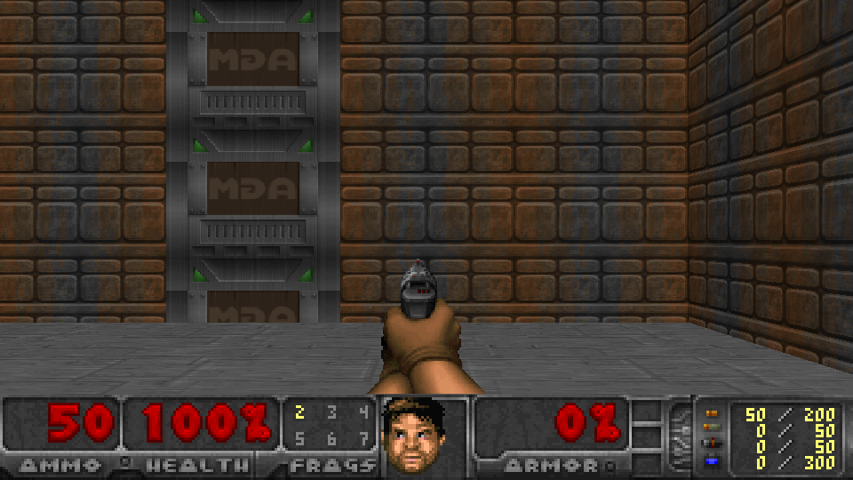
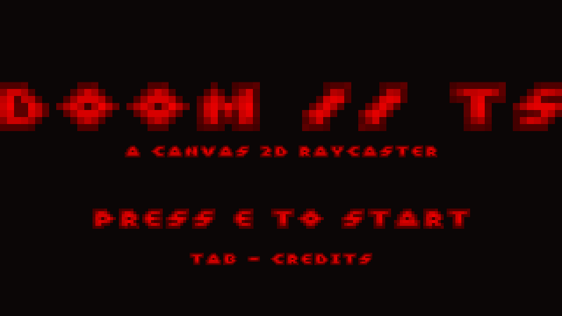
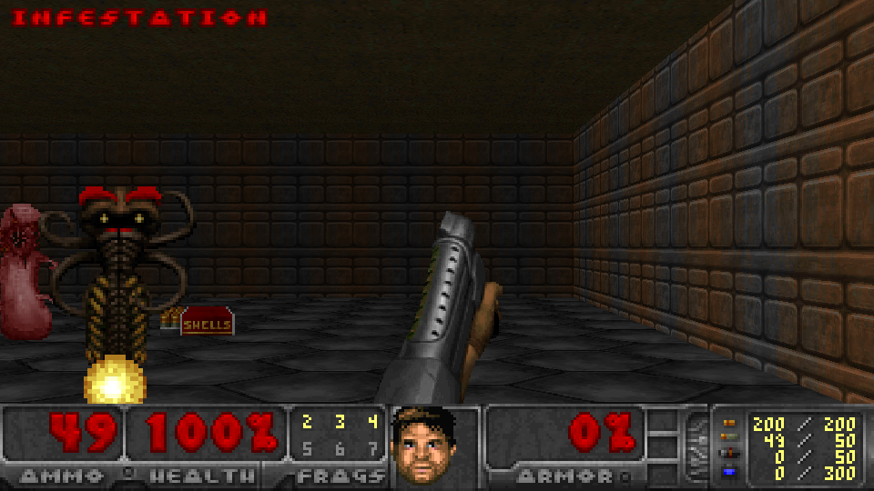
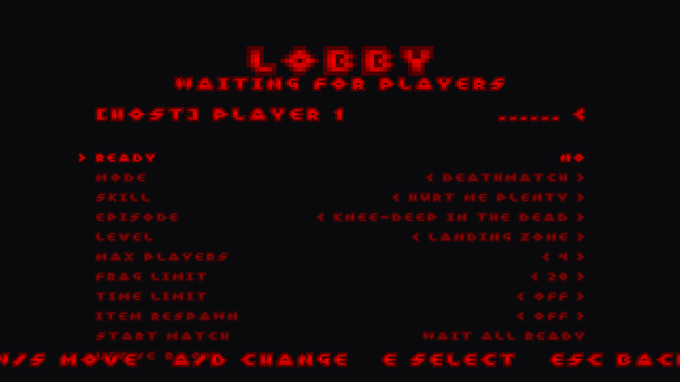

# DOOM-TS

A from-scratch, DOOM-style raycaster FPS built in **TypeScript** — single-player **and**
online multiplayer, running entirely in the browser. No engine, no WAD interpreter: a
hand-written Canvas 2D renderer, game sim, and lag-compensated netcode.

**▶ Live demo: https://185.249.197.74.sslip.io/**



## Screenshots

| Title | Combat | Multiplayer lobby |
|---|---|---|
|  |  |  |

## Features

- **Single-player** campaign — all 6 original "Knee-Deep in the Dead" levels, offline.
- **Online co-op** — fight through the campaign together, friendly-fire off.
- **PvP deathmatch** — frag limits, time limits, item respawn.
- **In-browser room browser** — see open games and join with one click, no room codes.
- **Canvas 2D raycaster** renderer — textured walls, sprites, HUD, automap.
- **Lag-compensated netcode** — client prediction + server reconciliation over Colyseus.
- **Freedoom assets** — sprites, textures, music, and SFX.

## Run it

```sh
npm install
npm run extract-assets   # needs the Freedoom WAD — see tools/extract-wad/README.md
```

| Goal | Command |
|---|---|
| Single-player | `npm run dev` → http://localhost:5173 |
| Multiplayer | `npm run server` (one terminal) + `npm run dev` (another) |
| Production build | `npm run build` |

Self-hosting the multiplayer server: see [`deploy/DEPLOY.md`](deploy/DEPLOY.md).
itch.io build: see [`ITCH.md`](ITCH.md) (`npm run build:itch`).

## Controls

| Action | Key |
|---|---|
| Move / strafe | `W` `A` `S` `D` |
| Look | Mouse |
| Fire | Left mouse |
| Weapons | `1`–`7` |
| Use / open door | `E` / `Space` |
| Automap / scoreboard | `Tab` |
| Menu / back | `Esc` |

## Tech stack

TypeScript · Vite · Canvas 2D · [Colyseus](https://colyseus.io/) (multiplayer)

## Credits & license

- **Art & audio:** [Freedoom](https://freedoom.github.io/) — BSD-3-Clause, freely
  redistributable. © Contributors to the Freedoom project.
- **Code:** © the author. License: *(your choice)*.
